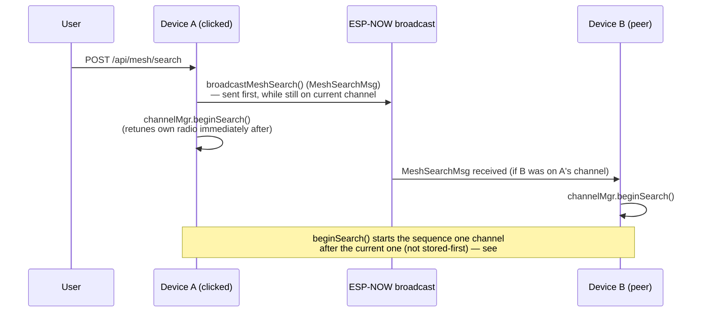

# Mesh channel search: boot, runtime, and manual re-search flows

This document visualizes how `ChannelManager` (`src/mesh/ChannelManager.h`), `WifiElection`/`WifiConnectAttempt` (`src/mesh/WifiElection.h`), and `setupWifi()` (`src/main.cpp`) cooperate to keep every device's ESP-NOW radio on a shared channel. See `docs/known-issues.md` for the split-mesh cases (#321, #323) referenced below.

## 1. Boot sequence

```mermaid
flowchart TD
    A[setup&#40;&#41;] --> B[setupWifi&#40;&#41;]
    B --> C{Config::wifiCount&#40;&#41; == 0?}
    C -- yes --> D[AP only<br/>WiFi.softAP&#40;&#41;]
    C -- no --> E{wifiSingleClientMode?}
    E -- yes --> F[AP up, no STA attempt here<br/>defer to WifiElection tick&#40;&#41;]
    E -- no --> G[Blocking connect loop:<br/>each configured network,<br/>3 attempts x up to 10s, list order]
    G --> H{Connected?}
    H -- yes --> I[AP off, STA connected<br/>save as last-good network]
    H -- no --> J[All networks failed<br/>fallback AP, channel 1]

    D --> K[channelMgr.begin&#40;&peers&#41;]
    F --> K
    I --> K
    J --> K

    K --> L{WiFi.status&#40;&#41; == WL_CONNECTED?}
    L -- yes --> M[Lock to WiFi.channel&#40;&#41;<br/>save to NVS]
    L -- no --> N[Start SEARCH<br/>sequence: stored channel first,<br/>then 1 / 6 / 11 &#40;deduped&#41;]
```

Notes:
- `setupWifi()`'s own connect loop is **blocking** (`delay()`-based); `channelMgr.begin()` only runs after it returns, so at boot the channel decision always sees the final `WiFi.status()` for that path.
- In single-client mode, `setupWifi()` never attempts a STA connection itself — `WifiElection` (see §2) does that later, non-blockingly, once ticking starts. `channelMgr.begin()` therefore almost always sees "not connected yet" in that mode and starts a search, then reacts to the eventual connect via the `tick()` transition in §2.

## 2. Continuous runtime (`tick()` every loop)

### 2a. `ChannelManager` state machine

```mermaid
stateDiagram-v2
    [*] --> Locked: begin&#40;&#41; saw WL_CONNECTED
    [*] --> Searching: begin&#40;&#41; saw not connected

    state Searching {
        [*] --> Dwelling
        Dwelling --> Dwelling: dwell not elapsed &#40;tick&#41;
        Dwelling --> NextChannel: dwell elapsed, peer not yet heard
        NextChannel --> Dwelling: apply next channel in sequence
        NextChannel --> RoundRetry: sequence exhausted, round < 2
        RoundRetry --> Dwelling: restart sequence &#40;round++&#41;
        NextChannel --> GiveUp: sequence exhausted, round == 2
    }

    Searching --> Locked: onPeerHeard&#40;mac&#41;<br/>&#40;mac not already known before this search, #321&#41;
    Searching --> Locked: WiFi.status&#40;&#41; becomes WL_CONNECTED mid-search<br/>&#40;lock to WiFi.channel&#40;&#41;&#41;
    GiveUp --> Locked: lock to COMMON_FALLBACK_CHANNEL &#40;1&#41;<br/>NVS unchanged

    Locked --> Locked: WiFi status unchanged &#40;tick is a no-op&#41;
    Locked --> Locked: WiFi reconnects &#40;WL_CONNECTED transition&#41;<br/>re-lock to new WiFi.channel&#40;&#41;, save to NVS
    Locked --> Searching: beginSearch&#40;&#41; called<br/>&#40;manual re-search, see §3&#41;
```

Key rules baked into this state machine:
- **Already-known peers don't end a search** (#321): during `Searching`, `onPeerHeard()` ignores MACs that were already in `PeerRegistry` when the search started (`_snapshotKnownPeers()`), so two devices that were already locked together can't just re-find each other on a random channel and immediately stop looking — they have to hear something *new* to lock.
- **Two full rounds before giving up** (#321): a single pass through `[stored, 1, 6, 11]` isn't enough to guarantee overlap with a staggered-boot peer, so the whole sequence repeats once before falling back.
- **Common fallback channel, not "my own stored channel"**: if nothing new is heard after both rounds, every searching device converges on channel `1`, not whatever it had stored — giving a mesh with mixed history one shared rendezvous point instead of everyone silently parking on a different channel.
- **A WiFi reconnect always wins**, whether idle/`Locked` or mid-`Searching` — an actual AP connection is authoritative over anything ESP-NOW search discovers.

### 2b. `WifiElection` (single-client mode only) — feeds `WiFi.status()` into 2a

```mermaid
stateDiagram-v2
    [*] --> Waiting
    Waiting --> Connected: self already connected &#40;adopt&#41;
    Waiting --> Standby: a peer is already connected
    Waiting --> Connecting: nobody connected, start WifiConnectAttempt

    Connecting --> Standby: a peer connected first &#40;abort own attempt&#41;
    Connecting --> Connected: WifiConnectAttempt succeeds
    Connecting --> GaveUp: every configured network exhausted

    Connected --> Waiting: lost connection &#40;re-elect&#41;
    Connected --> Standby: a lower-MAC peer is also connected &#40;yield&#41;

    Standby --> Waiting: elected peer went offline

    GaveUp --> Standby: some peer becomes connected
```

This only matters for channel search indirectly: whichever device is `Connected` here is the one whose `WiFi.status()` transition drives the `Searching → Locked` / `Locked → Locked` (re-lock) edges in §2a for that device. Devices in `Standby`/`GaveUp` never see a `WL_CONNECTED` transition of their own, so their `ChannelManager` only ever locks via `onPeerHeard` (ESP-NOW) or the search-exhausted fallback.

## 3. Manual "Search devices" button

`beginSearch()` reuses the exact `Searching` state machine from §2a (same dwell timing, same rounds, same fallback), just with a different starting channel and a snapshot of currently-known peers taken fresh at the click.

### The known dead end (#323): WiFi-connected devices ignore the click

```mermaid
flowchart TD
    A[beginSearch&#40;&#41; called] --> B[_state = Searching<br/>apply first search channel]
    B --> C[next tick&#40;&#41;]
    C --> D{WiFi.status&#40;&#41; == WL_CONNECTED?}
    D -- yes --> E["Searching + WiFi connected" branch<br/>in tick&#40;&#41; fires immediately]
    E --> F[Re-lock to WiFi.channel&#40;&#41;<br/>— the same channel as before the click]
    D -- no --> G[Proceed with normal Searching<br/>dwell/round logic from §2a]
```

Because `tick()` treats "WiFi is connected" as authoritative on every single tick (not just on the transition into connected), a device that's already connected to a WiFi network never actually leaves its current channel to search — `beginSearch()` flips it to `Searching`, but the very next `tick()` sees `WL_CONNECTED` still true and re-locks it right back. This is why the mesh split described in `known-issues.md` (#323) — devices connected to different APs/channels — has **no automatic escape hatch today**: the manual button only helps devices that are *not* currently WiFi-connected (they actually run the search in §2a and can converge on a new channel).
